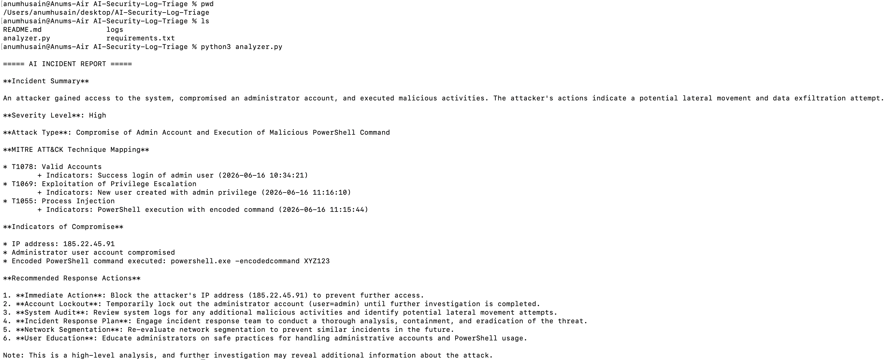

# AI Security Log Triage Tool

## Overview

An AI-assisted cybersecurity project that analyzes security logs and generates incident reports using Python and a locally deployed Large Language Model (LLM).

The goal of this project is to help security analysts perform faster initial log triage by identifying suspicious activity, classifying possible attacks, and recommending response actions.

---

## Features

- Reads and analyzes security logs
- Uses AI-assisted threat analysis
- Generates incident summaries
- Identifies possible attack types
- Extracts Indicators of Compromise (IoCs)
- Provides recommended response actions
- Maps activity to MITRE ATT&CK techniques

---

## Technologies Used

- Python
- Ollama
- Llama 3.1 Large Language Model
- MITRE ATT&CK Framework
- Git/GitHub

---

## How It Works

```
Security Logs
      |
      v
Python Analyzer
      |
      v
Ollama Runtime
      |
      v
Llama 3.1 LLM
      |
      v
Incident Report
```

---

## Example Detection

Input:

```
FAILED LOGIN user=admin
FAILED LOGIN user=admin
SUCCESS LOGIN user=admin
FILE ACCESS customer_database.csv
```

Output:

```
Incident:
Possible Brute Force Attack

Severity:
High

MITRE ATT&CK:
T1110 - Brute Force

Recommended Actions:
- Block suspicious IP
- Reset credentials
- Review access logs
```

---

## Project Structure

```
AI-Security-Log-Triage

├── analyzer.py
├── logs
│   └── sample_logs.txt
├── requirements.txt
├── README.md
└── .gitignore
```

---

## How To Run

1. Install dependencies:

```
pip install -r requirements.txt
```

2. Start Ollama and download the model:

```
ollama pull llama3.1
```

3. Run the analyzer:

```
python3 analyzer.py
```

---

## Future Improvements

- Connect to real SIEM data sources
- Add a security dashboard
- Add threat intelligence integration
- Store previous incidents
- Compare AI findings with analyst decisions

---

## Skills Demonstrated

- Python automation
- Security log analysis
- Incident response concepts
- AI/LLM integration
- MITRE ATT&CK mapping
- Cybersecurity workflow automation


## Example Output


